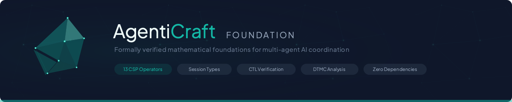
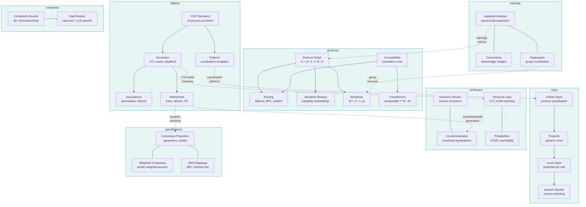
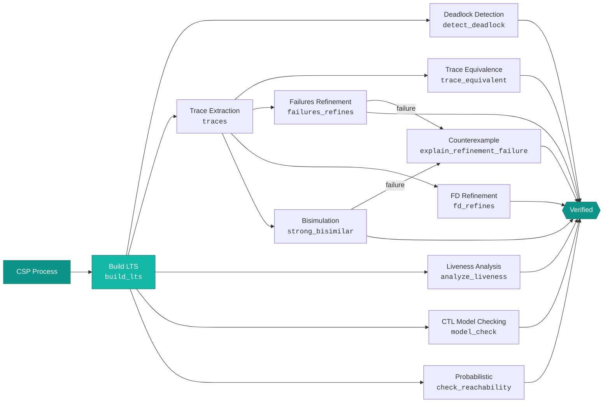

<div align="center">

<picture>
  <source media="(prefers-color-scheme: dark)" srcset="assets/readme-banner.svg">
  <source media="(prefers-color-scheme: light)" srcset="assets/readme-banner.svg">
  
</picture>

<br/>

[](https://github.com/agenticraft/agenticraft-foundation/actions/workflows/ci.yml)
[](https://codecov.io/gh/agenticraft/agenticraft-foundation)
[](https://www.python.org/downloads/)
[](LICENSE)

**Formally verified mathematical foundations for multi-agent AI coordination.**

13 CSP operators &middot; Multiparty Session Types &middot; Hypergraph Topology &middot; Multi-Protocol Routing &middot; CTL Model Checking &middot; Probabilistic Verification &middot; 1165 tests &middot; Zero dependencies

</div>

---

## Install

```bash
uv add agenticraft-foundation
```

Or with pip:

```bash
pip install agenticraft-foundation
```

## Quick Start

### Process Algebra

```python
from agenticraft_foundation import (
    Event, Prefix, Stop, Parallel,
    Interrupt, Timeout, Guard, TIMEOUT_EVENT,
    build_lts, traces, detect_deadlock, is_deadlock_free,
)

# Define agent events
process_data = Event("process_data")
handle_priority = Event("handle_priority")
return_result = Event("return_result")

# Build an interruptible agent task
task = Prefix(process_data, Prefix(return_result, Stop()))
handler = Prefix(handle_priority, Stop())
agent = Interrupt(primary=task, handler=handler)

# Agent can do its task OR be interrupted by priority request
assert process_data in agent.initials()
assert handle_priority in agent.initials()

# Add a timeout with fallback
fallback = Prefix(Event("return_cached"), Stop())
bounded = Timeout(process=agent, duration=30.0, fallback=fallback)

# Analyze the process
lts = build_lts(bounded)
print(f"States: {len(lts.states)}")
print(f"Deadlock-free: {is_deadlock_free(bounded)}")

deadlocks = detect_deadlock(bounded)
print(f"Deadlock states: {len(deadlocks.deadlock_states)}")

t = list(traces(lts, max_length=5))
print(f"Traces: {len(t)}")
```

### Multi-Protocol Routing

```python
from agenticraft_foundation.protocols import (
    ProtocolGraph,
    ProtocolAwareDijkstra,
    ProtocolConstrainedBFS,
    ResilientRouter,
    PathCostCalculator,
    ProtocolCompatibilityMatrix,
    PROTOCOL_COMPATIBILITY,
)
from agenticraft_foundation.types import ProtocolName

# Build a protocol graph G = (V, E, P, Φ, Γ)
graph = ProtocolGraph()
graph.add_agent("gateway", ["routing"], {ProtocolName.MCP, ProtocolName.A2A})
graph.add_agent("analyzer", ["analysis"], {ProtocolName.MCP})
graph.add_agent("executor", ["execution"], {ProtocolName.A2A})
graph.add_agent("reporter", ["output"], {ProtocolName.MCP, ProtocolName.A2A})

graph.add_edge("gateway", "analyzer", {ProtocolName.MCP})
graph.add_edge("gateway", "executor", {ProtocolName.A2A})
graph.add_edge("analyzer", "reporter", {ProtocolName.MCP})
graph.add_edge("executor", "reporter", {ProtocolName.A2A})

compat = ProtocolCompatibilityMatrix(PROTOCOL_COMPATIBILITY)
calc = PathCostCalculator(graph, compat)

# Dijkstra: minimum-cost routing with protocol translation
dijkstra = ProtocolAwareDijkstra(graph, compat, calc)
route = dijkstra.find_optimal_route("gateway", "reporter", ProtocolName.MCP)
print(f"Path: {route.path}, Cost: {route.total_cost:.2f}")

# BFS: minimum-hop routing
bfs = ProtocolConstrainedBFS(graph, compat, calc)
shortest = bfs.find_shortest_path("gateway", "reporter", ProtocolName.MCP)
print(f"Hops: {shortest.num_hops}")

# Resilient routing with failover
router = ResilientRouter(graph, compat, calc)
resilient = router.find_resilient_route(
    "gateway", "reporter", ProtocolName.A2A,
    failed_protocols=set(), failed_agents={"analyzer"},
)
print(f"Failover path: {resilient.path}")
```

### Hypergraph Topology

```python
from agenticraft_foundation.topology import HypergraphNetwork

# Model group coordination as hypergraph H = (V, E_h)
hg = HypergraphNetwork()
hg.add_hyperedge("team_a", {"agent1", "agent2", "agent3"}, weight=2.0)
hg.add_hyperedge("team_b", {"agent2", "agent3", "agent4"}, weight=1.5)
hg.add_hyperedge("all_hands", {"agent1", "agent2", "agent3", "agent4"})

# Spectral analysis: L_H = D_v − H W D_e⁻¹ Hᵀ
analysis = hg.analyze()
print(f"Algebraic connectivity (λ₂): {analysis.algebraic_connectivity:.4f}")
print(f"Consensus bound: {analysis.consensus_bound:.2f}")
print(f"Connected: {analysis.is_connected}")

# Group coordination metrics
coord = hg.analyze_group_coordination()
print(f"Participation ratio: {coord['participation_ratio']:.2f}")
print(f"Average group size: {coord['avg_group_size']:.1f}")
```

### Protocol Workflows

```python
from agenticraft_foundation.protocols import (
    ProtocolWorkflow, WorkflowTask, WorkflowValidator,
    OptimalProtocolAssigner,
)
from agenticraft_foundation.types import ProtocolName

# Define workflow W = (T, ≺, ρ)
workflow = ProtocolWorkflow(workflow_id="data_pipeline")
workflow.add_task(WorkflowTask(
    task_id="extract", capabilities=["data_access"],
    compatible_protocols={ProtocolName.MCP, ProtocolName.A2A},
))
workflow.add_task(WorkflowTask(
    task_id="transform", capabilities=["processing"],
    compatible_protocols={ProtocolName.MCP},
))
workflow.add_task(WorkflowTask(
    task_id="load", capabilities=["storage"],
    compatible_protocols={ProtocolName.MCP, ProtocolName.A2A},
))
workflow.add_edge("extract", "transform")
workflow.add_edge("transform", "load")

# Validate executability (Theorem 9)
validator = WorkflowValidator()
result = validator.validate(workflow, graph, compat)
print(f"Valid: {result.is_valid}, Errors: {result.errors}")

# Optimal protocol assignment (minimize translation cost)
assigner = OptimalProtocolAssigner()
assignment = assigner.assign(workflow, graph, compat, calc)
print(f"Protocol assignment: {assignment}")
```

## Architecture



## Operators

All 13 CSP operators implement the full `Process` contract: `kind`, `alphabet()`, `initials()`, `after(event)`.

```mermaid
graph LR
    process(["Process<br/><i>abstract base</i>"])

    subgraph primitives["Core Primitives"]
        direction TB
        stop["Stop &bull; STOP"]
        skip["Skip &bull; SKIP"]
        pre["Prefix &bull; a &rarr; P"]
        ec["ExternalChoice &bull; P &#9633; Q"]
        ic["InternalChoice &bull; P &#8851; Q"]
        par["Parallel &bull; P &#8214; Q"]
        seq["Sequential &bull; P ; Q"]
        hid["Hiding &bull; P \\ H"]
    end

    subgraph extensions["Agent Extensions"]
        direction TB
        int["Interrupt &bull; P &#9651; Q"]
        tmo["Timeout &bull; Timeout P,d,Q"]
        grd["Guard &bull; Guard c,P"]
        ren["Rename &bull; P a&larr;b"]
        pip["Pipe &bull; P |&gt; Q"]
    end

    subgraph recursion["Recursion"]
        direction TB
        rec["Recursion &bull; &mu;X.P"]
        var["Variable &bull; X"]
    end

    process --> primitives
    process --> extensions
    process --> recursion

    style process fill:#0D9488,stroke:#0F766E,color:#fff
    style primitives fill:#f0fdfa,stroke:#0D9488
    style extensions fill:#f0fdfa,stroke:#14B8A6
    style recursion fill:#f0fdfa,stroke:#0D9488
```



### Core Primitives (8)

| Operator | Symbol | Description |
|---|---|---|
| `Stop` | `STOP` | Deadlock -- no events possible |
| `Skip` | `SKIP` | Successful termination |
| `Prefix` | `a -> P` | Do event `a`, then behave as `P` |
| `ExternalChoice` | `P [] Q` | Environment chooses between P and Q |
| `InternalChoice` | `P \|~\| Q` | Process nondeterministically chooses |
| `Parallel` | `P \|\| Q` | Concurrent execution with synchronization |
| `Sequential` | `P ; Q` | P then Q (after P terminates) |
| `Hiding` | `P \ H` | Hide events in set H |

### Agent-Specific Extensions (5)

| Operator | Symbol | Description | Agent Use Case |
|---|---|---|---|
| `Interrupt` | `P triangle Q` | Preempt P when Q fires | Priority override, task cancellation |
| `Timeout` | `Timeout(P, d, Q)` | Bounded execution with fallback | LLM call timeout, retry with cache |
| `Guard` | `Guard(c, P)` | Conditional activation | Budget check, safety gate |
| `Rename` | `P[[a<-b]]` | Event vocabulary mapping | Protocol bridging between agents |
| `Pipe` | `P \|> Q` | Producer-consumer pipeline | RAG pipeline, multi-stage processing |

### Recursion

```python
from agenticraft_foundation import Recursion, Variable, Event, Prefix

# Recursive server: handle requests forever
req, resp = Event("request"), Event("response")
server = Recursion(
    variable="X",
    body=Prefix(req, Prefix(resp, Variable("X")))
)
```

## Verification Pipeline



### CTL Temporal Logic

```python
from agenticraft_foundation import build_lts, Event, Prefix, ExternalChoice, Stop
from agenticraft_foundation.verification import (
    model_check, AG, AF, EF, Not, Atomic, check_safety, check_liveness,
)

# Build an LTS from a CSP process
req, resp, err = Event("req"), Event("resp"), Event("err")
process = Prefix(req, ExternalChoice(
    Prefix(resp, Stop()),
    Prefix(err, Stop()),
))
lts = build_lts(process)

# Label states with atomic propositions
labeling = {s: set() for s in lts.states}
labeling[lts.initial_state].add("init")
for s in lts.states:
    if not lts.successors(s):  # terminal states
        labeling[s].add("done")

# Check: "from every reachable state, done is eventually reached"
result = model_check(lts, AF(Atomic("done")), labeling)
print(f"Always terminates: {result.satisfied}")

# Check: "error is never reachable"
result = check_safety(lts, "error", labeling)
print(f"Error-free: {result.satisfied}")
if not result.satisfied:
    print(f"Counterexample: {result.counterexample}")
```

### Probabilistic Verification (DTMC)

```python
from agenticraft_foundation.verification import (
    DTMC, check_reachability, steady_state, expected_steps,
)

# Model an LLM agent with retry logic
dtmc = DTMC()
dtmc.add_state(0, labels={"start"})
dtmc.add_state(1, labels={"processing"})
dtmc.add_state(2, labels={"success"})
dtmc.add_state(3, labels={"error"})
dtmc.add_transition(0, 1, probability=1.0)
dtmc.add_transition(1, 2, probability=0.9)   # 90% success
dtmc.add_transition(1, 3, probability=0.1)   # 10% transient failure
dtmc.add_transition(3, 1, probability=0.8)   # 80% retry succeeds
dtmc.add_transition(3, 3, probability=0.2)   # 20% stays in error
dtmc.add_transition(2, 2, probability=1.0)   # absorbing

# What's the probability of eventually reaching success?
result = check_reachability(dtmc, target_labels={"success"})
print(f"P(eventually success) = {result.probability:.4f}")

# Expected number of steps to reach success
steps = expected_steps(dtmc, target_labels={"success"})
print(f"E[steps to success] = {steps.expected:.2f}")
```

### Counterexample Generation

```python
from agenticraft_foundation import Event, Prefix, ExternalChoice, Stop
from agenticraft_foundation.algebra import trace_refines
from agenticraft_foundation.verification import explain_refinement_failure

# Spec allows req then either resp or close
req, resp, close = Event("req"), Event("resp"), Event("close")
spec = Prefix(req, ExternalChoice(Prefix(resp, Stop()), Prefix(close, Stop())))

# Impl only handles resp (missing close)
impl = Prefix(req, Prefix(resp, Stop()))

result = trace_refines(spec, impl)
if not result.is_valid:
    explanation = explain_refinement_failure(spec, impl, result)
    print(explanation.summary)
    # "Impl trace ⟨req⟩ diverges from spec at step 1"
    print(f"Spec allowed: {explanation.spec_allowed}")
    print(f"Impl attempted: {explanation.impl_attempted}")
```

## Modules

| Module | What it provides | Tests |
|---|---|---|
| `algebra` | CSP operators, LTS semantics, trace/failures equivalence, refinement checking, 6 coordination patterns | 219 |
| `mpst` | Multiparty Session Types -- global/local types, projection, runtime session monitoring, 4 communication patterns | 270 |
| `protocols` | Multi-protocol mesh model -- graph representation, Dijkstra/BFS/resilient routing, semantic routing, workflow validation, composable transformers, protocol specifications | 259 |
| `topology` | Spectral graph analysis -- Laplacian decomposition, algebraic connectivity, bridge detection, hypergraph group coordination | 57 |
| `specifications` | Formal consensus properties (agreement, validity, integrity, termination), weighted quorum consensus, MAS theory mappings (BDI, Joint Intentions, SharedPlans, Contract Net) | 65 |
| `complexity` | Complexity bounds for distributed algorithms (30+ bounds), fault models (classical + LLM-specific), impossibility results (FLP, Byzantine) | 44 |
| `verification` | Runtime invariant checking, structured counterexample generation, CTL temporal logic model checking, probabilistic verification (DTMC reachability, steady-state, expected steps) | 199 |
| `integration` | MPST bridge adapter (MCP/A2A session types), CSP orchestration adapter (DAG-to-CSP, workflow verification) | 52 |

### Imports

```python
# Process algebra
from agenticraft_foundation.algebra import trace_refines, failures_refines, strong_bisimilar

# Session types
from agenticraft_foundation.mpst import Projector, SessionTypeChecker, SessionMonitor

# Topology
from agenticraft_foundation.topology import NetworkGraph, LaplacianAnalysis
from agenticraft_foundation.topology import HypergraphNetwork, HypergraphAnalysis

# Protocol routing
from agenticraft_foundation.protocols import (
    ProtocolGraph, ProtocolAwareDijkstra,
    ProtocolConstrainedBFS, ResilientRouter, SemanticRouter,
)

# Protocol workflows and transformers
from agenticraft_foundation.protocols import (
    ProtocolWorkflow, WorkflowValidator, OptimalProtocolAssigner,
    TransformerRegistry, ComposedTransformer,
)

# Specifications
from agenticraft_foundation.specifications import (
    WeightedConsensusState, WeightedAgreement, WeightedQuorum,
    BDIMapping, ContractNetMapping, JointIntentionMapping, SharedPlanMapping,
)

# Complexity
from agenticraft_foundation.complexity import (
    CONSENSUS_BOUNDS, GOSSIP_BOUNDS, MESH_COMMUNICATION_BOUNDS,
    FaultModel, ComplexityClass,
)

# Verification — invariant checking
from agenticraft_foundation.verification import (
    InvariantRegistry, check_invariant, assert_invariant, StateTransitionMonitor,
)

# Verification — counterexamples
from agenticraft_foundation.verification import (
    explain_refinement_failure, explain_equivalence_failure,
    find_minimal_counterexample, CounterexampleExplanation,
)

# Verification — CTL temporal logic
from agenticraft_foundation.verification import (
    model_check, Atomic, Not, And, Or, EX, EF, EG, EU, AX, AF, AG, AU,
    check_safety, check_liveness, ModelCheckResult,
)

# Verification — probabilistic (DTMC)
from agenticraft_foundation.verification import (
    DTMC, check_reachability, steady_state, expected_steps, build_dtmc_from_lts,
)
```

## Protocol Graph Model

The multi-protocol mesh is modeled as **G = (V, E, P, Φ, Γ)** where:

- **V** -- Agent nodes with capabilities and supported protocols
- **E** -- Edges with protocol sets Φ(u,v) and weights
- **P** -- Protocol universe {MCP, A2A, ANP, ...}
- **Φ** -- Protocol assignment function E → 2ᴾ
- **Γ** -- Protocol affinity function V × P → [0,1]

### Node Types

| Type | Description |
|---|---|
| `LLM_AGENT` | Language model agent with inference capabilities |
| `TOOL_SERVER` | Stateless tool/function provider |
| `COORDINATOR` | Orchestration and routing agent |
| `GATEWAY` | Protocol translation bridge |

### Routing Algorithms

| Algorithm | Class | Strategy | Complexity |
|---|---|---|---|
| Dijkstra | `ProtocolAwareDijkstra` | Minimum-cost with protocol translation | O((V+E) log V) |
| BFS | `ProtocolConstrainedBFS` | Minimum-hop with protocol constraints | O(V + E) |
| Resilient | `ResilientRouter` | Failover with degraded topology | O((V+E) log V) |
| Semantic | `SemanticRouter` | Capability similarity + affinity scoring | O(V * C) |

### Protocol Transformers

Composable message transformers **T: M_p → M_p' ∪ {⊥}** with classification:

| Classification | Property | Example |
|---|---|---|
| Lossless | T⁻¹(T(m)) = m | Identity, format-only changes |
| Lossy | T⁻¹(T(m)) ≈ m | Metadata reduction, field aggregation |
| Destructive | T⁻¹(T(m)) may be ⊥ | Incompatible protocol families |

Transformers compose: **T_{p→p''} = T_{p'→p''} ∘ T_{p→p'}**. The `TransformerRegistry` auto-composes via BFS when no direct transformer exists.

## Hypergraph Topology

Standard graphs model pairwise agent connections. Hypergraphs generalize this to **group coordination** where a single hyperedge connects multiple agents simultaneously.

**Hypergraph Laplacian**: L_H = D_v − H W D_e⁻¹ Hᵀ

- **H** -- Incidence matrix (nodes × hyperedges)
- **W** -- Diagonal weight matrix
- **D_v** -- Node degree matrix
- **D_e** -- Hyperedge degree matrix

The algebraic connectivity (λ₂) of the hypergraph Laplacian bounds consensus convergence time: **T = O(n log n / λ₂)**.

Factory constructors:
- `HypergraphNetwork.from_graph(edges)` -- Convert pairwise edges to 2-hyperedges
- `HypergraphNetwork.clique_expansion(groups)` -- Build from group membership

## Fault Models

Classical distributed systems fault models extended with LLM-specific failure modes:

| Fault Model | Description | Classical Analog |
|---|---|---|
| `CRASH_STOP` | Process halts permanently | -- |
| `CRASH_RECOVERY` | Process halts and may restart | -- |
| `BYZANTINE` | Arbitrary (including malicious) behavior | -- |
| `OMISSION` | Fails to send or receive messages | -- |
| `HALLUCINATION` | Generates confident but incorrect output | Byzantine (incorrect) |
| `PROMPT_INJECTION` | External input corrupts agent behavior | Byzantine (malicious) |
| `NON_DETERMINISM` | Same input produces different outputs | Omission (partial) |
| `CONTEXT_OVERFLOW` | Exceeds context window, loses information | Crash-recovery |

## Complexity Bounds

30+ catalogued bounds across distributed algorithms:

| Category | Examples |
|---|---|
| Consensus | Synchronous crash O(f+1) rounds, async FLP impossibility, Byzantine Θ(n²) messages |
| Gossip | Convergence O(n log n), diameter-bounded O(D log n) |
| Leader Election | Synchronous O(n), async Ω(n log n) |
| Broadcast | Flooding O(n²), spanning tree O(n) |
| Mesh Communication | Full mesh O(n) messages, tree O(n) / O(log n) rounds, ring O(n) / O(n) rounds |

## Weighted Consensus

Quality-weighted quorum consensus assigns weights **wᵢ** to agents based on historical reliability. A quorum requires total weight exceeding **2W/3** to guarantee:

- **Weighted Agreement**: No two correct quorums decide differently
- **Weighted Validity**: Decided values come from proposals with sufficient weight
- **Weighted Quorum Intersection**: Any two quorums share honest-majority weight

## MAS Theory Mappings

Bidirectional mappings between classical multi-agent systems theory and mesh coordination:

| Theory | Mapping |
|---|---|
| **BDI** | Beliefs → context state, Desires → task objectives, Intentions → active assignments |
| **Joint Intentions** | Mutual belief → consensus state, persistent goal → task completion condition |
| **SharedPlans** | Recipe → task decomposition DAG, subgroup plans → agent cluster assignments |
| **Contract Net** | Manager broadcasts CFP → bidders respond → manager awards → execution reports |

Each mapping preserves formal properties bidirectionally via `verify_mapping_preservation()`.

## Project Structure

```
src/agenticraft_foundation/
    algebra/           # CSP process algebra (8 files)
    mpst/              # Multiparty Session Types (7 files)
    topology/          # Network + hypergraph topology (4 files)
    protocols/         # Multi-protocol mesh model (10 files)
    specifications/    # Formal consensus + MAS specs (3 files)
    complexity/        # Bounds + fault models (2 files)
    verification/      # Invariant checking, counterexamples, CTL, DTMC (4 files)
    integration/       # Bridge adapters (2 files)
    types.py           # Shared type definitions
tests/                 # 1165 tests across 33 test modules
```

## Development

```bash
# Install dev dependencies
uv sync --group dev

# Run tests
uv run pytest tests/ -v

# Run with coverage
uv run pytest tests/ --cov=agenticraft_foundation --cov-report=html

# Lint
uv run ruff check src/ tests/

# Format
uv run ruff format src/ tests/

# Type check
uv run mypy src/
```

## Why Formal Methods for Agents?

Multi-agent systems fail in production because coordination bugs are invisible until runtime. Formal verification catches them at design time:

- **Deadlock detection** -- Find states where no agent can make progress
- **Trace analysis** -- Verify all possible execution sequences
- **Refinement checking** -- Prove implementation matches specification
- **Counterexample generation** -- Structured explanations of why verification fails
- **Temporal logic** -- CTL model checking: "always", "eventually", "until" over LTS
- **Probabilistic verification** -- DTMC reachability, steady-state, expected steps for stochastic agents
- **Protocol verification** -- Ensure multi-agent communication is well-formed
- **Spectral analysis** -- Quantify topology resilience via algebraic connectivity
- **Workflow validation** -- Verify protocol executability before deployment
- **Fault tolerance** -- Model LLM-specific failure modes alongside classical faults

## References

- Hoare, C.A.R. (1985). *Communicating Sequential Processes*. Prentice Hall.
- Milner, R. (1980). *A Calculus of Communicating Systems*. Springer.
- Roscoe, A.W. (1998). *The Theory and Practice of Concurrency*. Prentice Hall.
- Clarke, E.M., Emerson, E.A. (1981). Design and Synthesis of Synchronization Skeletons Using Branching Time Temporal Logic. *Workshop on Logics of Programs*.
- Baier, C., Katoen, J.-P. (2008). *Principles of Model Checking*. MIT Press.
- Hansson, H., Jonsson, B. (1994). A Logic for Reasoning about Time and Reliability. *Formal Aspects of Computing*.
- Honda, K., Yoshida, N., Carbone, M. (2016). Multiparty Asynchronous Session Types. *JACM*.
- Fischer, M.J., Lynch, N.A., Paterson, M.S. (1985). Impossibility of Distributed Consensus with One Faulty Process. *JACM*.
- Castro, M., Liskov, B. (1999). Practical Byzantine Fault Tolerance. *OSDI*.
- Rao, A.S., Georgeff, M.P. (1995). BDI Agents: From Theory to Practice. *ICMAS*.
- Smith, R.G. (1980). The Contract Net Protocol. *IEEE Transactions on Computers*.

## Citation

```bibtex
@software{agenticraft_foundation,
  title = {agenticraft-foundation: Formally Verified Foundations for Multi-Agent AI},
  author = {Khateeb, Zaher},
  year = {2026},
  url = {https://github.com/agenticraft/agenticraft-foundation},
  version = {0.1.0},
}
```

## License

Apache License 2.0
