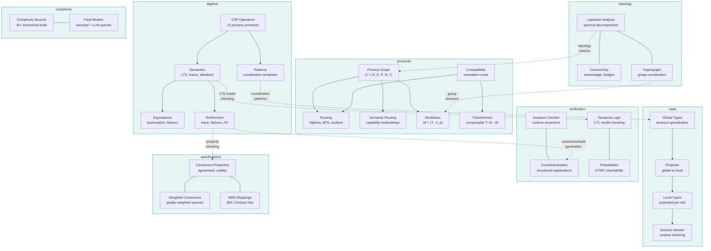

<div align="center">

<picture>
  <source media="(prefers-color-scheme: dark)" srcset="assets/readme-banner.svg">
  <source media="(prefers-color-scheme: light)" srcset="assets/readme-banner.svg">
  
</picture>

<br/>

[](https://github.com/agenticraft/agenticraft-foundation/actions/workflows/ci.yml)
[](https://codecov.io/gh/agenticraft/agenticraft-foundation)
[](https://www.python.org/downloads/)
[](LICENSE)

**Formally verified mathematical foundations for multi-agent AI coordination.**

The core verification engine behind [AgentiCraft](https://agenticraft.ai) — an enterprise-grade platform for building production-ready AI agents and multi-agent systems.

13 CSP operators &middot; Multiparty Session Types &middot; Hypergraph Topology &middot; Multi-Protocol Routing &middot; CTL Model Checking &middot; Probabilistic Verification &middot; 1300+ tests &middot; Minimal dependencies

</div>

---

## Install

With [uv](https://docs.astral.sh/uv/) (recommended):

```bash
uv add agenticraft-foundation
```

Or with pip:

```bash
pip install agenticraft-foundation
```

## Quick Start

```python
from agenticraft_foundation import (
    Event, Prefix, Stop, Parallel,
    Interrupt, Timeout, Guard, TIMEOUT_EVENT,
    build_lts, traces, detect_deadlock, is_deadlock_free,
)

# Define agent events
process_data = Event("process_data")
handle_priority = Event("handle_priority")
return_result = Event("return_result")

# Build an interruptible agent task
task = Prefix(process_data, Prefix(return_result, Stop()))
handler = Prefix(handle_priority, Stop())
agent = Interrupt(primary=task, handler=handler)

# Agent can do its task OR be interrupted by priority request
assert process_data in agent.initials()
assert handle_priority in agent.initials()

# Add a timeout with fallback
fallback = Prefix(Event("return_cached"), Stop())
bounded = Timeout(process=agent, duration=30.0, fallback=fallback)

# Analyze the process
lts = build_lts(bounded)
print(f"States: {len(lts.states)}")
print(f"Deadlock-free: {is_deadlock_free(bounded)}")

deadlocks = detect_deadlock(bounded)
print(f"Deadlock states: {len(deadlocks.deadlock_states)}")

t = list(traces(lts, max_length=5))
print(f"Traces: {len(t)}")
```

See the [RAG pipeline verification](examples/rag_pipeline_verification.py) for an end-to-end example combining CSP, deadlock detection, topology analysis, and temporal logic across 4 agents. More examples in the [docs](https://agenticraft.github.io/agenticraft-foundation/examples/).

## Architecture



## Operators

All 13 CSP operators implement the full `Process` contract: `kind`, `alphabet()`, `initials()`, `after(event)`.

### Core Primitives (8)

| Operator | Symbol | Description |
|---|---|---|
| `Stop` | `STOP` | Deadlock -- no events possible |
| `Skip` | `SKIP` | Successful termination |
| `Prefix` | `a -> P` | Do event `a`, then behave as `P` |
| `ExternalChoice` | `P [] Q` | Environment chooses between P and Q |
| `InternalChoice` | `P \|~\| Q` | Process nondeterministically chooses |
| `Parallel` | `P \|\| Q` | Concurrent execution with synchronization |
| `Sequential` | `P ; Q` | P then Q (after P terminates) |
| `Hiding` | `P \ H` | Hide events in set H |

### Agent-Specific Extensions (5)

| Operator | Symbol | Description | Agent Use Case |
|---|---|---|---|
| `Interrupt` | `P triangle Q` | Preempt P when Q fires | Priority override, task cancellation |
| `Timeout` | `Timeout(P, d, Q)` | Bounded execution with fallback | LLM call timeout, retry with cache |
| `Guard` | `Guard(c, P)` | Conditional activation | Budget check, safety gate |
| `Rename` | `P[[a<-b]]` | Event vocabulary mapping | Protocol bridging between agents |
| `Pipe` | `P \|> Q` | Producer-consumer pipeline | RAG pipeline, multi-stage processing |

See the [full operator reference](https://agenticraft.github.io/agenticraft-foundation/concepts/process-algebra/) for recursion, verification pipeline, and detailed semantics.

## Modules

| Module | What it provides | Tests |
|---|---|---|
| `algebra` | CSP operators, LTS semantics, trace/failures equivalence, refinement checking, 6 coordination patterns | 219 |
| `mpst` | Multiparty Session Types -- global/local types, projection, runtime session monitoring, 4 communication patterns | 270 |
| `protocols` | Multi-protocol mesh model -- graph representation, Dijkstra/BFS/resilient routing, semantic routing, workflow validation, composable transformers, protocol specifications | 259 |
| `topology` | Spectral graph analysis -- Laplacian decomposition, algebraic connectivity, bridge detection, hypergraph group coordination | 57 |
| `specifications` | Formal consensus properties (agreement, validity, integrity, termination), weighted quorum consensus, MAS theory mappings (BDI, Joint Intentions, SharedPlans, Contract Net) | 65 |
| `complexity` | Complexity bounds for distributed algorithms (30+ bounds), fault models (classical + LLM-specific), impossibility results (FLP, Byzantine) | 44 |
| `verification` | Runtime invariant checking, structured counterexample generation, CTL temporal logic model checking, probabilistic verification (DTMC reachability, steady-state, expected steps) | 199 |
| `integration` | MPST bridge adapter (MCP/A2A session types), CSP orchestration adapter (DAG-to-CSP, workflow verification) | 52 |

See the docs for: [Protocol Graph Model](https://agenticraft.github.io/agenticraft-foundation/concepts/protocol-graph/) | [Verification Pipeline](https://agenticraft.github.io/agenticraft-foundation/concepts/verification/) | [Spectral Topology](https://agenticraft.github.io/agenticraft-foundation/concepts/spectral-topology/) | [Fault Models & Complexity](https://agenticraft.github.io/agenticraft-foundation/concepts/complexity/) | [Consensus & MAS Mappings](https://agenticraft.github.io/agenticraft-foundation/concepts/consensus/) | [Full API Reference](https://agenticraft.github.io/agenticraft-foundation/api/)

## Development

```bash
# Install dev dependencies
uv sync --group dev

# Run tests
uv run pytest tests/ -v

# Run with coverage
uv run pytest tests/ --cov=agenticraft_foundation --cov-report=html

# Lint
uv run ruff check src/ tests/

# Format
uv run ruff format src/ tests/

# Type check
uv run mypy src/
```

## Why Formal Methods for Agents?

Multi-agent systems fail in production because coordination bugs are invisible until runtime. Formal verification catches them at design time:

- **Deadlock detection** -- Find states where no agent can make progress
- **Trace analysis** -- Verify all possible execution sequences
- **Refinement checking** -- Prove implementation matches specification
- **Counterexample generation** -- Structured explanations of why verification fails
- **Temporal logic** -- CTL model checking: "always", "eventually", "until" over LTS
- **Probabilistic verification** -- DTMC reachability, steady-state, expected steps for stochastic agents
- **Protocol verification** -- Ensure multi-agent communication is well-formed
- **Spectral analysis** -- Quantify topology resilience via algebraic connectivity
- **Workflow validation** -- Verify protocol executability before deployment
- **Fault tolerance** -- Model LLM-specific failure modes alongside classical faults

## References

- Hoare, C.A.R. (1985). *Communicating Sequential Processes*. Prentice Hall.
- Roscoe, A.W. (1998). *The Theory and Practice of Concurrency*. Prentice Hall.
- Clarke, E.M., Emerson, E.A. (1981). Design and Synthesis of Synchronization Skeletons Using Branching Time Temporal Logic. *Workshop on Logics of Programs*.
- Baier, C., Katoen, J.-P. (2008). *Principles of Model Checking*. MIT Press.
- Honda, K., Yoshida, N., Carbone, M. (2016). Multiparty Asynchronous Session Types. *JACM*.

See the [full references](https://agenticraft.github.io/agenticraft-foundation/changelog/) in the documentation.

## Citation

```bibtex
@software{agenticraft_foundation,
  title = {agenticraft-foundation: Formally Verified Foundations for Multi-Agent AI},
  author = {Khateeb, Zaher},
  year = {2026},
  url = {https://github.com/agenticraft/agenticraft-foundation},
  version = {0.1.0},
}
```

## License

Apache License 2.0
