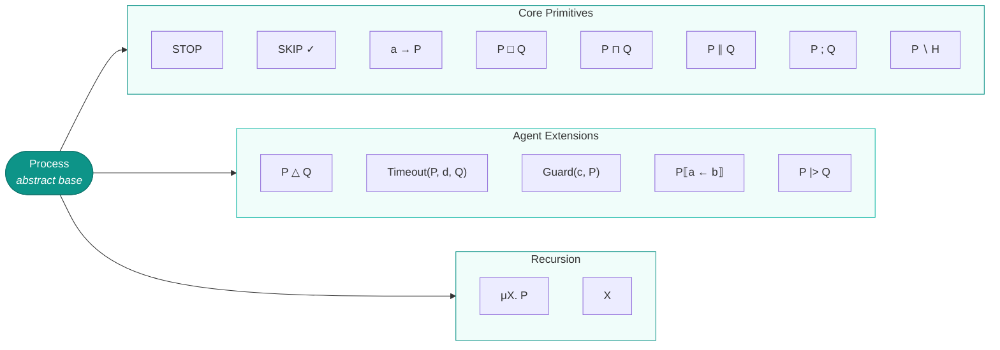
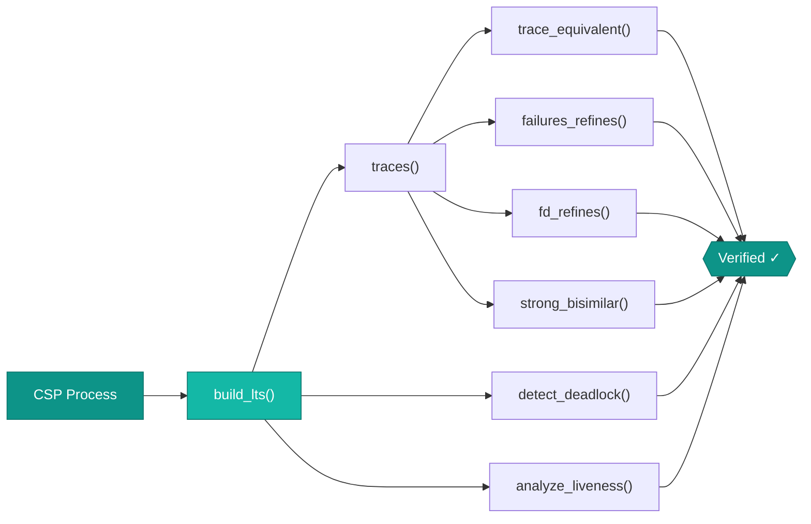

# Process Algebra (CSP)

## Overview

Communicating Sequential Processes (CSP) is Tony Hoare's formalism for modeling concurrent systems that interact through message passing. In the context of multi-agent systems, CSP provides a rigorous way to specify how agents coordinate, synchronize, and communicate -- then verify that the resulting system is free of deadlocks, livelocks, and protocol violations.

AgentiCraft Foundation implements **13 CSP operators** covering core primitives, agent-specific extensions, and recursion. Every operator produces a process that can be compiled to a Labeled Transition System (LTS) for automated verification.

## Key Definitions

- **Process**: An abstract entity that engages in events drawn from its alphabet $\alpha(P)$. A process defines a set of possible behaviors.

- **Event**: An atomic, instantaneous action $a \in \Sigma$ where $\Sigma$ is the universal event set.

- **Trace**: A finite sequence of events $t \in \Sigma^*$. The set of all possible traces of process $P$ is written $\text{traces}(P)$.

- **Labeled Transition System (LTS)**: A tuple $(S, \Sigma, \to, s_0)$ where $S$ is a set of states, $\Sigma$ is the event alphabet, $\to \subseteq S \times \Sigma \times S$ is the transition relation, and $s_0 \in S$ is the initial state.

- **Deadlock**: A state $s \in S$ with no outgoing transitions in the LTS. A deadlocked system can make no further progress.

- **Refinement**: Process $Q$ refines process $P$, written $P \sqsubseteq Q$, iff $\text{traces}(Q) \subseteq \text{traces}(P)$. This is trace refinement -- an implementation $Q$ satisfies a specification $P$ when every behavior of $Q$ is permitted by $P$.

## Operators

### Core Primitives (8)

| Operator | Symbol | Description |
|----------|--------|-------------|
| **Stop** | $\text{STOP}$ | Deadlocked process -- engages in no events |
| **Skip** | $\text{SKIP}$ | Successfully terminating process -- signals completion with $\checkmark$ |
| **Prefix** | $a \to P$ | Engages in event $a$ then behaves as $P$ |
| **External Choice** | $P \mathbin{[]} Q$ | Environment chooses between $P$ and $Q$ based on their initial events |
| **Internal Choice** | $P \mathbin{|\sim|} Q$ | Process nondeterministically chooses between $P$ and $Q$ |
| **Parallel** | $P \mathbin{\|} Q$ | Processes execute concurrently, synchronizing on shared events |
| **Sequential** | $P \mathbin{;} Q$ | Process $P$ runs to completion, then $Q$ begins |
| **Hiding** | $P \mathbin{\setminus} H$ | Events in set $H$ become internal (invisible to the environment) |

### Agent Extensions (5)

| Operator | Symbol | Description |
|----------|--------|-------------|
| **Interrupt** | $P \mathbin{\triangle} Q$ | Process $P$ runs until $Q$'s initial event occurs, then control transfers to $Q$ |
| **Timeout** | $\text{Timeout}(P, d, Q)$ | If $P$ does not engage in an event within duration $d$, control transfers to $Q$ |
| **Guard** | $\text{Guard}(c, P)$ | Process $P$ is only enabled when boolean condition $c$ holds |
| **Rename** | $P[\![a \leftarrow b]\!]$ | Renames event $a$ to $b$ in all traces of $P$ |
| **Pipe** | $P \mathbin{|>} Q$ | Output events of $P$ become input events of $Q$ (piped composition) |

### Recursion (2)

| Operator | Symbol | Description |
|----------|--------|-------------|
| **Recursion** | $\mu X. P$ | Recursive process definition -- $X$ within $P$ refers back to the whole |
| **Variable** | $X$ | Bound variable referencing the enclosing recursive definition |

## Operator Hierarchy



## Verification Pipeline

The verification pipeline compiles CSP processes into an LTS, then runs multiple analyses to establish correctness properties.



**Verification checks available:**

- **Deadlock Detection**: Identifies states with no outgoing transitions. A deadlock-free system guarantees that agents never reach a state where no progress is possible.
- **Trace Extraction**: Enumerates all possible event sequences up to a configurable depth bound.
- **Liveness Analysis**: Checks that desired events are eventually reachable -- no agent starves.
- **Trace Equivalence**: Two processes are trace-equivalent iff they have identical trace sets.
- **Failures Refinement**: Strengthened refinement that also considers refusal sets -- what a process can refuse to do.
- **FD Refinement**: Failures-divergences refinement, the strongest standard CSP refinement ordering.
- **Bisimulation**: Structural equivalence -- two processes are bisimilar iff they can simulate each other step-by-step.

## Coordination Patterns

The CSP operators compose into standard multi-agent coordination patterns:

| Pattern | CSP Structure | Description |
|---------|--------------|-------------|
| **Request-Response** | $\text{req} \to \text{resp} \to \text{SKIP}$ | Single synchronous exchange between two agents |
| **Pipeline** | $P_1 \mathbin{|>} P_2 \mathbin{|>} P_3$ | Sequential data flow through a chain of processing agents |
| **Scatter-Gather** | $(P_1 \mathbin{\|} P_2 \mathbin{\|} P_3) \mathbin{;} \text{collect}$ | Parallel fan-out to multiple agents, then collect results |
| **Barrier** | $P_1 \mathbin{\|} P_2$ synchronized on $\text{barrier}$ | All agents must reach a synchronization point before proceeding |
| **Mutex** | $\text{acquire} \to P \mathbin{;} \text{release} \to \text{SKIP}$ | Mutual exclusion -- only one agent accesses a shared resource at a time |
| **Producer-Consumer** | $\text{produce} \to \text{consume} \to \mu X. P$ | Recurring handoff of work items between producer and consumer agents |

## How It Maps to Code

```python
from agenticraft_foundation import (
    Event, Prefix, Stop, Skip, ExternalChoice, InternalChoice,
    Parallel, Sequential, Hiding, Interrupt, Timeout,
    Guard, Rename, Pipe, Recursion, Variable,
    build_lts, is_deadlock_free,
)

# Define a simple request-response process
req = Event("request")
resp = Event("response")
request_response = Sequential(
    Prefix(req, Prefix(resp, Skip())),
    Stop()
)

# Build the Labeled Transition System
lts = build_lts(request_response)

# Verify deadlock freedom
assert is_deadlock_free(lts)
```

## Further Reading

- **API Reference**: [algebra/processes](../api/algebra/csp.md), [algebra/semantics](../api/algebra/semantics.md)
- **Tutorial**: [CSP Coordination Patterns](../tutorials/csp-coordination.md)

### References

- C.A.R. Hoare, *Communicating Sequential Processes*, Prentice Hall, 1985.
- A.W. Roscoe, *The Theory and Practice of Concurrency*, Prentice Hall, 1998.
