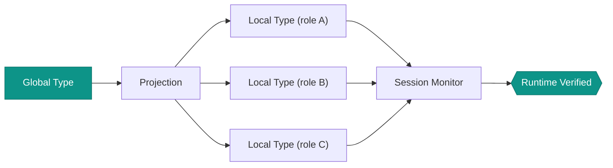

# Multiparty Session Types

## Overview

Multiparty Session Types (MPST) provide a type-theoretic framework for specifying and verifying communication protocols involving multiple participants. Where CSP models processes and their event traces, session types model the **structure of message exchanges** -- who sends what to whom, in what order, and with what payload types. This makes MPST particularly well-suited for specifying agent-to-agent protocols where correctness depends on all parties adhering to a shared communication contract.

AgentiCraft Foundation implements the Honda-Yoshida-Carbone formalism with global type definition, per-role projection, well-formedness checking, and runtime session monitoring.

## Key Definitions

- **Global Type**: A protocol specification from a bird's-eye view describing the complete message flow. A message exchange from participant $p$ to participant $q$ carrying payload type $T$ is written:

  $$G = p \to q : \langle T \rangle . G'$$

  where $G'$ is the continuation of the protocol.

- **Local Type**: The projected per-role view of the global protocol. Each participant sees only the sends and receives relevant to them.

- **Projection**: The operation $G \upharpoonright r$ maps a global type $G$ to the local type for role $r$. Projection extracts exactly the communication actions that involve role $r$.

- **Well-formedness**: A global type is well-formed when:
  - No ambiguous choices (each branch is distinguishable by the receiving role)
  - All roles participate correctly (no role is required to act on information it cannot observe)
  - The protocol is deadlock-free by construction

- **Session Monitor**: A runtime component that intercepts message exchanges and checks conformance against the local type. If an agent sends a message that violates the protocol, the monitor raises a violation before the message is delivered.

- **Choice**: A branching point where one role selects among labeled alternatives:

  $$G = p \to q : \{l_1 : G_1, \; l_2 : G_2, \; \ldots\}$$

  Role $p$ sends a label $l_i$ to role $q$, and the protocol continues as $G_i$.

- **Recursion**: Protocols with repeated phases use recursive types:

  $$G = \mu X. \; p \to q : \langle T \rangle . X$$

## MPST Workflow



The workflow proceeds in two phases:

1. **Design time**: Define the global type, project it to local types for each role, and check well-formedness. If projection succeeds, the protocol is guaranteed deadlock-free and type-safe by construction.
2. **Runtime**: Session monitors attached to each agent enforce the local type. Every send and receive is checked against the expected next action in the local type.

## Communication Patterns

### Request-Response

The simplest MPST pattern: one agent sends a request, another replies.

$$G = \text{client} \to \text{server} : \langle \text{Request} \rangle . \; \text{server} \to \text{client} : \langle \text{Response} \rangle . \; \text{end}$$

### Pipeline

Sequential processing through a chain of agents, each forwarding a transformed result to the next.

$$G = A \to B : \langle T_1 \rangle . \; B \to C : \langle T_2 \rangle . \; C \to D : \langle T_3 \rangle . \; \text{end}$$

### Scatter-Gather

A coordinator fans out work to multiple agents, then collects all results.

$$G = \text{coord} \to W_1 : \langle \text{Task} \rangle . \; \text{coord} \to W_2 : \langle \text{Task} \rangle . \; W_1 \to \text{coord} : \langle \text{Result} \rangle . \; W_2 \to \text{coord} : \langle \text{Result} \rangle . \; \text{end}$$

### Consensus

A multi-round protocol where agents exchange proposals and votes until agreement is reached.

$$G = \mu X. \; \text{proposer} \to \text{voter}_1 : \langle \text{Proposal} \rangle . \; \text{proposer} \to \text{voter}_2 : \langle \text{Proposal} \rangle . \; \text{voter}_1 \to \text{proposer} : \langle \text{Vote} \rangle . \; \text{voter}_2 \to \text{proposer} : \langle \text{Vote} \rangle . \; \text{proposer} \to \text{all} : \{$$
$$\quad \text{commit} : \text{end}, \quad \text{retry} : X$$
$$\}$$

## How It Maps to Code

```python
from agenticraft_foundation.mpst import (
    MessageType, EndType,
    project, WellFormednessChecker, SessionMonitor,
)

# Define a global type for request-response
global_type = MessageType(
    sender="client",
    receiver="server",
    payload="Request",
    continuation=MessageType(
        sender="server",
        receiver="client",
        payload="Response",
        continuation=EndType(),
    ),
)

# Project to local types
client_local = project(global_type, "client")
server_local = project(global_type, "server")

# Check well-formedness
checker = WellFormednessChecker()
result = checker.check(global_type)
assert result.is_well_formed

# Attach runtime monitors
client_monitor = SessionMonitor(local_type=client_local)
server_monitor = SessionMonitor(local_type=server_local)
```

## Further Reading

- **API Reference**: [sessions/global_types](../api/mpst/global-types.md), [sessions/projection](../api/mpst/local-types.md), [sessions/monitors](../api/mpst/checker.md)
- **Tutorial**: [Session-Typed Protocols](../tutorials/mpst-verification.md)

### References

- K. Honda, N. Yoshida, M. Carbone, "Multiparty Asynchronous Session Types," *Journal of the ACM*, 63(1), 2016.
