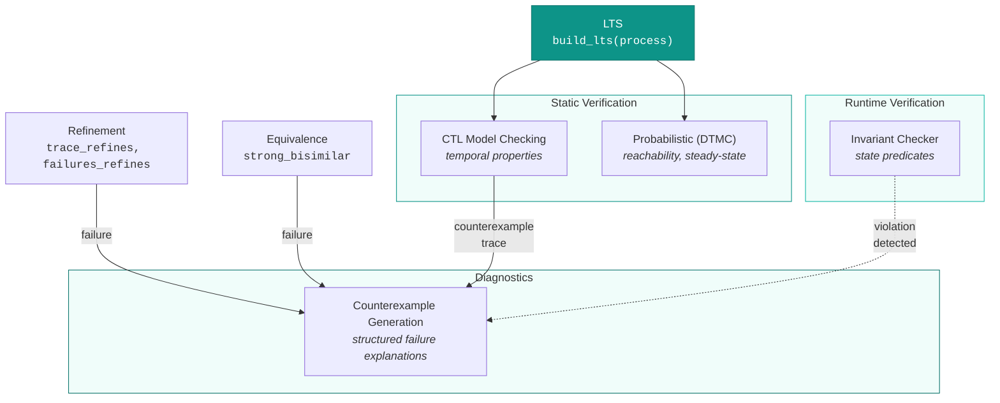

# Verification

## Overview

Verification is the process of establishing that a system satisfies desired properties *before* deployment. For multi-agent systems built on LLM agents, this is especially important: agents are nondeterministic, stochastic, and prone to failure modes that don't exist in traditional software (hallucination, context overflow, prompt injection).

AgentiCraft Foundation provides **4 verification submodules** that address complementary aspects of system correctness:

| Submodule | Question It Answers | Formalism |
|-----------|---------------------|-----------|
| **Invariant Checker** | Does the runtime state satisfy required properties? | State predicates, transition monitoring |
| **Counterexamples** | *Why* does verification fail? | Synchronized product LTS, BFS divergence search |
| **Temporal Logic** | Does the system satisfy "always", "eventually", "until" properties? | CTL backward fixpoint (Clarke & Emerson 1981) |
| **Probabilistic** | What is the probability of reaching a given state? | DTMC reachability (Hansson & Jonsson 1994) |

## Key Definitions

- **Invariant**: A predicate $\phi(s)$ that must hold in every reachable state $s$. Violation of an invariant indicates a bug.

- **Counterexample**: A concrete execution trace $t = \langle a_1, a_2, \ldots, a_k \rangle$ that demonstrates a property violation. A good counterexample is *minimal* -- no shorter trace exhibits the same violation.

- **CTL Formula**: A formula in Computation Tree Logic, interpreted over the states of an LTS. CTL combines path quantifiers ($\mathbf{A}$ -- all paths, $\mathbf{E}$ -- exists a path) with temporal operators ($\mathbf{X}$ -- next, $\mathbf{F}$ -- eventually, $\mathbf{G}$ -- globally, $\mathbf{U}$ -- until).

- **DTMC**: A Discrete-Time Markov Chain $(S, P, \iota, L)$ where $S$ is a finite set of states, $P: S \times S \to [0,1]$ is a stochastic transition matrix ($\sum_{s'} P(s,s') = 1$), $\iota$ is the initial distribution, and $L: S \to 2^{AP}$ is a labeling function.

- **Reachability Probability**: For target set $T \subseteq S$, the probability $\Pr^s(\Diamond T)$ of eventually reaching $T$ from state $s$, computed by solving the linear system $p(s) = \sum_{s'} P(s,s') \cdot p(s')$ with boundary conditions $p(s) = 1$ for $s \in T$.

## How the Submodules Connect



**Runtime vs. static**: The invariant checker monitors live system state (it's a runtime tool). CTL and DTMC operate on the LTS or a Markov chain model (they're static/design-time tools). Counterexample generation works with both -- it can explain failures from refinement checking, equivalence checking, or CTL model checking.

## CTL Temporal Logic

CTL formulas are built from atomic propositions and composed with temporal operators:

| Operator | Meaning | Common Use |
|----------|---------|------------|
| $\mathbf{AG}(\phi)$ | $\phi$ holds in *all* states on *all* paths | Safety: "error never happens" |
| $\mathbf{AF}(\phi)$ | $\phi$ *eventually* holds on *all* paths | Liveness: "task always completes" |
| $\mathbf{EF}(\phi)$ | $\phi$ is *reachable* on *some* path | Reachability: "success is possible" |
| $\mathbf{EG}(\phi)$ | $\phi$ can hold *forever* on *some* path | Persistence: "can stay healthy" |
| $\mathbf{AU}(\phi, \psi)$ | $\phi$ holds *until* $\psi$ on *all* paths | Progress: "processing until done" |
| $\mathbf{EU}(\phi, \psi)$ | $\phi$ holds *until* $\psi$ on *some* path | Conditional reachability |

The model checker uses **backward fixpoint computation**: starting from the set of states satisfying the innermost subformula, it iteratively expands using predecessor relations until a fixpoint is reached. This runs in $O(|S| \cdot |\to| \cdot |\phi|)$ time.

## Probabilistic Verification

For stochastic agents, nondeterminism is replaced by probability. A DTMC assigns a probability to each transition, enabling quantitative questions:

| Analysis | Question | Algorithm |
|----------|----------|-----------|
| **Reachability** | $\Pr(\Diamond \text{error})$ = ? | Gaussian elimination on linear system |
| **Steady-state** | Long-run fraction of time in each state? | Power iteration: $\pi = \pi P$ |
| **Expected steps** | $\mathbb{E}[\text{steps to success}]$ = ? | Solve $e(s) = 1 + \sum P(s,s') \cdot e(s')$ |

All algorithms are pure Python with zero dependencies. Gaussian elimination handles systems up to ~100 states exactly; value iteration provides a convergent fallback for larger systems.

## How It Maps to Code

```python
from agenticraft_foundation.verification import (
    # Invariant checking (runtime)
    InvariantRegistry, check_invariant, StateTransitionMonitor,
    # Counterexamples (diagnostics)
    explain_refinement_failure, explain_equivalence_failure,
    find_minimal_counterexample, CounterexampleExplanation,
    # CTL temporal logic (static)
    model_check, AG, AF, EF, EG, EU, AU, AX, EX,
    Atomic, Not, And, Or, Implies,
    check_safety, check_liveness, ModelCheckResult,
    # Probabilistic (static)
    DTMC, check_reachability, steady_state, expected_steps,
)
```

## Further Reading

- **API Reference**: [verification/invariant-checker](../api/verification/invariant-checker.md), [verification/counterexamples](../api/verification/counterexamples.md), [verification/temporal](../api/verification/temporal.md), [verification/probabilistic](../api/verification/probabilistic.md)
- **Tutorials**: [Checking Temporal Properties with CTL](../tutorials/temporal-verification.md), [Modeling Stochastic Agents with DTMC](../tutorials/probabilistic-analysis.md)
- **Examples**: [Temporal Verification](../examples/temporal-verification.md), [Probabilistic Verification](../examples/probabilistic-verification.md), [Counterexample Generation](../examples/counterexample-generation.md)

### References

- E.M. Clarke, E.A. Emerson, "Design and Synthesis of Synchronization Skeletons Using Branching Time Temporal Logic", *Workshop on Logics of Programs*, 1981.
- C. Baier, J.-P. Katoen, *Principles of Model Checking*, MIT Press, 2008.
- H. Hansson, B. Jonsson, "A Logic for Reasoning about Time and Reliability", *Formal Aspects of Computing*, 1994.
