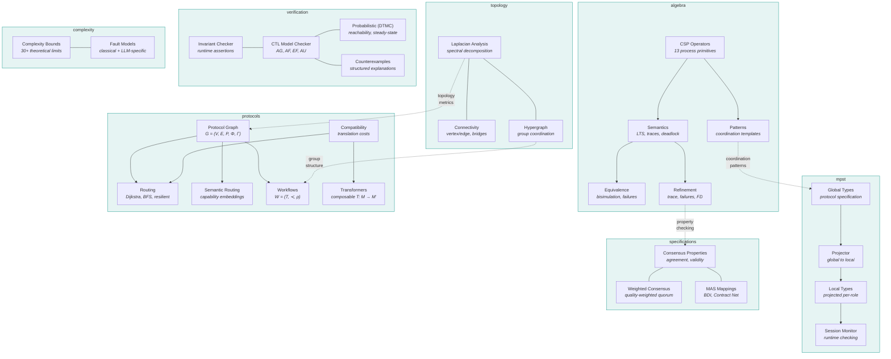

# AgentiCraft Foundation

**Formally verified mathematical foundations for multi-agent AI coordination.** AgentiCraft Foundation provides 8 modules spanning CSP process algebra, multiparty session types, protocol-aware routing, spectral topology analysis, and formal specification -- all with zero runtime dependencies. The library delivers the mathematical guarantees that production multi-agent systems need: deadlock freedom, trace refinement, protocol well-formedness, and topology resilience bounds.

---

## Architecture

---

## Modules at a Glance

| Module | Description | Tests |
|--------|-------------|-------|
| **algebra** | CSP process algebra -- 13 operators, LTS semantics, trace/failures refinement, deadlock detection | 219 |
| **mpst** | Multiparty session types -- global/local types, projection, session monitoring, well-formedness checking | 270 |
| **protocols** | Protocol-aware routing -- protocol graphs, Dijkstra/BFS/resilient routing, compatibility matrices, workflows | 259 |
| **topology** | Spectral topology analysis -- Laplacian decomposition, algebraic connectivity, hypergraph group coordination | 57 |
| **specifications** | Formal specifications -- consensus properties, weighted quorum, BDI and Contract Net mappings | 65 |
| **complexity** | Complexity theory -- 30+ theoretical bounds, classical and LLM-specific fault models | 44 |
| **verification** | Verification -- CTL temporal logic model checking, DTMC probabilistic analysis, invariant checking, counterexample generation | 199 |
| **integration** | Integration adapters -- MPST bridge for protocol session types, CSP orchestration for workflow verification | 52 |

**Total: 8 modules, 1,165 tests, ~20K LOC, zero dependencies.**

---

## Quick Links

- [Getting Started: Installation](getting-started/installation.md) -- install the package and set up a development environment
- [Getting Started: Quick Start](getting-started/quickstart.md) -- four self-contained examples covering the core modules
- [Getting Started: Why Formal Methods?](getting-started/why-formal-methods.md) -- when and why to use formal verification for multi-agent systems
- [API Reference](api/index.md) -- complete module and class reference
- [Concepts](concepts/index.md) -- detailed explanations of the mathematical foundations
- [Tutorials](tutorials/index.md) -- step-by-step walkthroughs for common tasks
